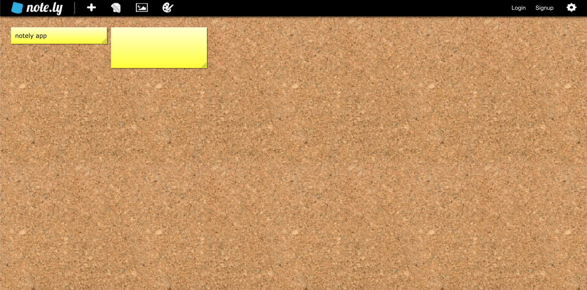

# Connections_Lab Project Two
 
Project 2 - Create a web application that allows a user to send and receive data. Your project should incorporate NodeJS, Express and either NeDB for storage or Socket.io for real-time multi-person data exchange. The aim is to produce an experience where users can interact, either alone or with one another, and submit data that is stored (NeDB) and/or exchanged (Socket.io) and represented to other users either in real-time or on a static page.

See project [here](https://stick-it.glitch.me/).

## Project Plan
### Inspiration

For Project 2, I decided to create a collaborative note-taking application that is based off of real communal sticky note boards. As someone who uses sticky notes almost on a daily basis and sticks them all around my space, I was inspired to make an application to make it digital and collaborative where people can see, edit and contribute to each other's notes. To allow teams to collaborate on their own separate boards, I planned to create rooms where information displayed is specific to each room. 

#### 1. [*Miro*](https://miro.com/app/)


My main inspiration came from the Miro application (shown above). It is a visual collaboration platform where people can choose from a variety of visual note-taking templates to create shared boards and contribute together on them in real-time. I found it especially useful for brainstorming and organizing ideas when working in groups, which is exactly how I got to know about it last summer for my online class group project. When I visited the app again this semester not much as a user but as a spectator to examine the design and user experience, I was surprised to see just how many features there are available for the user to utilize, perhaps slightly extensive for the regular user. There is also a 3-board limit for each team, so once the limit is reached, payment will be needed to add more boards. 

Based on these observations, I intended to make my application focusing specifically on the sticky-note format with a simple interface that still supports real-time interactions and helps organize/visualize notes. 

#### 2. [*Notely*](https://note.ly/)



Another source of inspiration came from the Notely website. It seemed more similar to my idea than Miro, except that it wasn't built for collaboration, but rather for personal use. Nonetheless, I was able to get an idea of how I could structure my application from Notely.


### Design and Planning


As the application will support rooms, there will be two main pages: landing page for entering user name and room name, and based on the room inputted, the user will be taken to the board page. For teams that are collaborating, they must enter the same room name to be able to view each other's notes and make edits. On the board page, there will be 3 main sections: top bar, side bar and the main board area. At the top bar, the user can see the room they are in, how many users are in the room and also go back to the homepage using the 'back' button. The side bar is reserved for the functionality, which is selecting the color of the sticky note and adding it onto the screen. In terms of design, I planned to go for a slightly colorful template that gives off youthful feeling as I expected majority of my audience to be students and young adults. 


### Process
After making the rough wireframes, I began coding, starting off with the board page. I was initially quite worried if I was going to be able to complete the project, especially adding the functionality of adding a note, text on the screen and also removing it when needed, so I wanted to work on the hardest part first and have it ready before user testing. This time around, I was able to position the elements on the website much quickly, so I was very happy about it. The add note functionality that I was intimidated about proved to be quite manageable, as I mostly played around with appendChild, removeChild to add and remove images of sticky-notes. The difficult part was displaying the text inputted by the user in a good position and most importantly on the specific note that was clicked by the user. But after referring back to my Project 1 and just attempting many different ways, I finally was able to display the text inside the note. 

### User Testing 
During user testing, I got really good feedback and advice, ranging from big-picture comments to remarks on small details that I didn't think of before and was really helpful. Some of the notable observations include:
- attempting to drag sticky notes with the mouse to change position
- attempting to select sticky note and resize
- using enter key to submit input
- having a bit of trouble when closing text area and individual sticky notes as the buttons were small

Some of the feedback I received include:
- changing the color of sticky notes
- showing the names of the people who wrote the note
- color coding notes based on which user wrote it
- evenly space out the sticky notes on the screen so that it looks more organized
- play sound when a note gets deleted so that other users can be notified even when they were not paying attention

The feedback that I got were incredibly helpful and I tried to sort through them and implement those that I thought would improve the user experience. I also kept in mind the advice that Professor Mathura said to me, which was to always make conscious decisions, think about why a certain feature/functionality is necessary and the purpose it would serve for the larger goal of my applcation without trying to imitate other applications and without trying to take in everyone's feedback to heart. Bearing all of these in mind, I went back to coding. 

### Process Continued


After user testing, I began working on the connected part of the application. I wrote a rough list of the data to exchange between the server and the client, which made the process a bit easier. Since I had the add/remove note functionality figured out on the front-end, I only had to make a few changes to it when implementing them together with sockets. Since a lot of the information that was being displayed was susceptible to constant change, including room size and text content, I had to make sure to remove the previous information first before updating to match the current one. For example, 

```
// upon receiving room size from the server, display it on the top bar
socket.on('roomSize', (data) => {
    let memberCountArea = document.getElementById('member-count');

    // if the count variable that is incremented whenever new socket joins the room is greater than 0, this means the room size displayed on the screen needs to be updated 
    if (count > 0)
        // remove the old value first
        memberCountArea.removeChild(memberCountArea.lastChild);
    
    // display it on the top bar
    let memberCount = document.createElement('p');
    memberCount.innerHTML = data;
    memberCountArea.appendChild(memberCount);

    count++;
})
```

Moreover, when adding sticky notes on the board, each note had to have its own individual id so that when the user later tries to insert text in it or remove it by clicking on it, it would be easily identified. Therefore, whenever a new note instance was added, I had to give it a unique id. 

```
function addText(noteID, noteText, noteType, noteContributor){
    let noteArea = document.getElementById(`note-box-wrapper${noteID}`);
    let textWrapper = document.createElement('div');
    textWrapper.id = `text-wrapper${noteID}`;
    textWrapper.classList.add('text-wrapper');
    let text = document.createElement('p');
    text.classList.add('text');
    text.id = `text${noteID}`;
    text.innerHTML = noteText;
    textWrapper.appendChild(text);
    noteArea.appendChild(textWrapper);
}
```

One of the features I added to my application based on user testing was displaying the name of the person who wrote the note. Since the notes are editable by everyone in the room, I took this idea and planned to show the names of all the users who contributed to each note at the bottom. Whenever a user made changes to the text, I got its username, sent it to the server, received it back from the server and displayed it on the note if the name was not already displayed. This part was added to the addText function. 

```
    // for displaying name of the user who contributed to/edited the text for this specific sticky note
    let userListWrapper = document.createElement('div');
    userListWrapper.id = `user-wrapper${noteID}`;
    userListWrapper.classList.add('user-wrapper');
    // p element containing user names of users that contributed to this note
    let textUserList = document.createElement('p');
    textUserList.id = `textUser${noteID}`;
    textUserList.innerHTML = noteContributor;
    userListWrapper.appendChild(textUserList);
    noteArea.appendChild(userListWrapper);
```

Another feedback that I implemented was adding sound effect. One of my classmates mentioned that when they are typing text into the text area and someone deletes a note, they wouldn't easily know about it. Adding sound effect was a great way to notify the users whenever a note was deleted so that they remember to look over the notes again to see the updated version. I added a crumpling sound effect whenever a note was removed to give off the idea that the note was getting crumpled and tossed into the trash. I found the sound from Zapsplat and cropped the sound slightly to make it not too long. When I used the sound without making any changes to the loudness, I felt like the sound was a bit too overwhelming and loud, so I used Audacity to normalize the audio loudness and make it softer. I decided not to add sound for adding a note just because I figured it might get too noise-crowded, especially when different users remove and add note at the same time. 

I also added color options for sticky notes to make it more visually appealing and organized. Since I was using image for the sticky-note, I played around with the saturation, contrast, warmth and other features of the image and came up with 6 different colored notes on top of the original yellow. Therefore, whenever the user changes the default yellow color to a different color, the value selected will be used to determine which image to upload on to the board. 

```
    // based on the value of the color received from server, determine the source of image
    // value 1 corresponds to yellow note
    if (color=='1')
        note.src = 'images/note1.png'
    // orange
    else if (color=='2')
        note.src = 'images/note2.png'
    // pink
    else if (color=='3')
        note.src = 'images/note3.png'
    // purple
    else if (color=='4')
        note.src = 'images/note4.png'
    // blue
    else if (color=='5')
        note.src = 'images/note5.png'
    // green
    else if (color=='6')
        note.src = 'images/note6.png'
    // neutral
    else
        note.src = 'images/note7.png'

    noteWrapper.appendChild(note);
```

Other small edits include increasing the clickable area of the remove buttons and centering the notes on the screen as well as evenly spacing them out. 

### Next Steps
I absolutely enjoyed working on this project as it was an application that I saw myself using frequently. However, the project is nowhere near finishing and I want to add more features and functionalities to make it a fully complete application. The most important is including databases to store the previous information. For this app to be regularly used, users need to be able to save their notes without worrying that the notes they spent so much time adding will be deleted the moment they refresh or get disconnected from the internet. Moreover, the application right now is quite plain and too simple, so adding more features such as font selection, canvas for handwritten, illustrated notes could make the app more fun to use. All in all, I got so much more confident using sockets through this project and I'm quite proud of the outcome too!

### Credits
[Sticky note image](https://www.flaticon.com/free-icon/sticky-notes_3209265?term=sticky%20note&page=1&position=4&page=1&position=4&related_id=3209265&origin=search) taken from flaticon

[Sticky note icon](https://www.flaticon.com/free-icon/sticky-notes_3209265?term=sticky%20note&page=1&position=4&page=1&position=4&related_id=3209265&origin=search) taken from flaticon

[Sound effect](https://www.zapsplat.com/page/3/?s=crumple+paper&post_type=music&sound-effect-category-id) taken from Zapsplat

